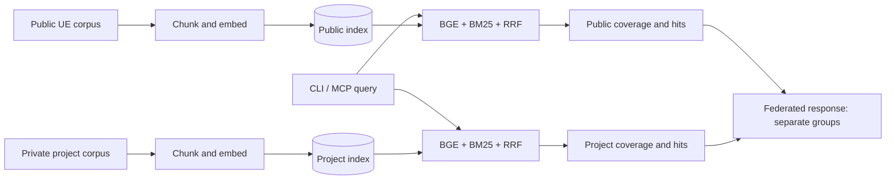

# UE Knowledge Base

[](https://pypi.org/project/ue-knowledge-base/)
[](https://github.com/dong273/ue-knowledge-base/actions)
[](LICENSE)

**English** · [简体中文](README.zh-CN.md)

> Offline UE knowledge for developers and AI agents.

- **Offline & private** — download the model, build an index, then search on a local CPU.
- **Version & evidence aware** — inspect sources and verification metadata before applying UE API advice.
- **Agent ready** — use the CLI, JSON output, or a resident MCP server.

## Quick start

```bash
pip install ue-knowledge-base   # install

ue-kb download-model            # one-time ~100MB model (auto-falls back to hf-mirror)
ue-kb build                     # build the index (~1 min, fully offline from here)
ue-kb query "GAS ability cooldown"
ue-kb query "Niagara particle collision" --json   # JSON output for agents
ue-kb query "GAS cooldown" --profile vector       # 0.4-compatible vector fallback
```

## Query examples with evidence

These examples come from the committed [retrieval validation record](validation/artifacts/coverage-wave06.json), not a new run in this documentation update.

| Query | Recorded first source | Coverage |
| --- | --- | --- |
| `Automation 测试怎样验证断言` | `ue-testing-debugging/SKILL.md` | `supported` |
| `运行时创建组件为什么要 RegisterComponent 和 AddInstanceComponent` | `ue-actor-component-architecture/SKILL.md` | `supported` |
| `白盒关卡首次游玩引导可发现性如何自动验证` | None | `none` |

Run `ue-kb query "Automation 测试怎样验证断言" --envelope --json` to inspect your local results. Coverage describes corpus support; it does not replace project testing or human acceptance.

## Architecture



Public and private project corpora are built and stored separately; a project index is optional. Federation preserves per-index coverage and result groups without comparing scores across indexes. See the [implementation](src/ue_knowledge/federation.py) and [CLI reference](#cli-reference).

**Current package: [v0.7.0 on PyPI](https://pypi.org/project/ue-knowledge-base/0.7.0/).** Recorded audit and release gates are documented in the [release checklist](docs/releasing.md).

## Why this exists

| Problem | Status quo | This project |
|---|---|---|
| **UE knowledge is scattered** | Answers live in forums, blogs, videos and English docs; one question = a dozen sources | 31 topics, **99 structured original documents**, one search away |
| **LLMs hallucinate UE APIs** | Generic models blur the UE 5.4 vs 5.7 differences and hand you "looks right" code | Documents are distilled from **real project work**; each section and code artifact is labeled, and high-risk UE 5.7 API/runtime claims link to source, compile, or Automation evidence |
| **Cloud RAG costs money & leaks code** | Every query ships your game code to an API and bills you per token | **100% local, zero API cost** — code never leaves your machine |
| **Docs lose fidelity in translation** | Translated or re-summarized docs blur UE terminology and drift from actual engine behavior | **Original English corpus** — written in the engine's own language, nothing lost in translation; bilingual topics keep Chinese queries working |

Covers: Gameplay Ability System, character movement, animation, AI navigation,
networking/replication, UMG/Slate, Niagara, Mass Entity, State Trees, PCG,
materials/rendering, module build system, editor tools, and more
(full 31-topic list ships inside the package — see `ue_knowledge/knowledge/`).

## Highlights

- 99 original documents (97 English, 2 bilingual; Chinese query support spans
  all 31 topics via the glossary), split into Markdown-aware chunks
  of at most 384 embedding tokens; the release verifier generates and checks
  the exact chunk count instead of keeping a stale number in this README
- Chinese terminology expansion + spoken-Chinese phrase dictionary
  (`zh_dict.json`, every concept grounded in the corpus vocabulary) +
  vector/BM25 RRF fusion. The held-out gate (62 queries, 2 per topic)
  reached **100% Chinese / 100% English Recall@3** on the release machine;
  an independent set of **31 natural spoken-Chinese queries** (no
  glossary-alias wording) scores **96.8% Recall@3** against the 25.8%
  vector-only baseline. The same harness reports the tuning split so
  alias-shaped queries cannot inflate the numbers (see
  `scripts/evaluate_retrieval.py`)
- No API key, no tokens, no server — `pip install` and go
- Embedding + retrieval happen locally; code never leaves your machine
- Every command supports `--json`; patterns for Hermes / Claude Code /
  OpenCode / any custom pipeline; `ue-kb serve` is an MCP server that keeps
  the model loaded for fast agent query loops
- China-friendly: GitHub mirror clone + Tsinghua PyPI + automatic
  hf-mirror fallback — no proxy needed
- ~100MB model, laptop CPU, no GPU; index build ~1 min; on the release machine
  cold CLI query ~7s (model load), warm in-process query <0.1s

## Install in mainland China (zero proxy)

```bash
# 1. Get the code (GitHub mirrors, pick either)
git clone --depth 1 https://gh-proxy.com/https://github.com/dong273/ue-knowledge-base.git
#   git clone --depth 1 https://ghfast.top/https://github.com/dong273/ue-knowledge-base.git

# 2. Install dependencies (Tsinghua PyPI mirror)
pip install -e . -i https://pypi.tuna.tsinghua.edu.cn/simple

# 3. Download the model (mirror fallback is automatic)
ue-kb download-model

# 4. Build the index (fully local; offline from here on)
ue-kb build

# 5. Search
ue-kb query "GAS ability cooldown"
```

## CLI reference

| Command | Description | Example |
| --- | --- | --- |
| `ue-kb build` | Chunk + embed a named public or project corpus into ChromaDB | `ue-kb build --scope public --force` |
| `ue-kb build --append` | Snapshot sync: add new chunks, replace edits and remove stale chunks; never append project content to a public snapshot | `ue-kb build --scope project --append` |
| `ue-kb query "..."` | Hybrid search by default; top-k hits with source + heading | `ue-kb query "角色移动 速度衰减" --top-k 5` |
| `ue-kb query --profile vector` | Fall back to 0.4-style vector-only ranking | `ue-kb query "GAS" --profile vector` |
| `ue-kb query --demote-frontmatter` | List content chunks before topic-summary chunks; fusion scores unchanged | `ue-kb query "GAS" --demote-frontmatter` |
| `ue-kb query --envelope` | Add `coverage` and evidence metadata; `none` answers abstain instead of returning misleading hits | `ue-kb query "project H1" --envelope --json` |
| `ue-kb audit-corpus` | Audit schema-v2 claims, code artifacts, evidence and verification metadata | `ue-kb audit-corpus --scope public --json` |
| `ue-kb federated-query` | Query public/project indexes in separate score groups | `ue-kb federated-query "question" --index public=<PUBLIC_INDEX> --index project=<PROJECT_INDEX> --json` |
| `ue-kb info` | Manifest, generation, staleness and model-match status | `ue-kb info --json` |
| `ue-kb doctor` | Read-only package, index and MCP runtime diagnostics | `ue-kb doctor --json --mcp-smoke` |
| `ue-kb download-model` | One-time embedding model download | `ue-kb download-model` |
| `ue-kb serve` | MCP stdio server: load the model once, answer queries in process (fast agent loops) | `ue-kb serve` |
| `ue-kb serve` tools | MCP tools: `ue_kb_query`, `ue_kb_federated_query`, `ue_kb_info`, `ue_kb_topics`, `ue_kb_glossary` + `resources/list` / `resources/read` | via any MCP client |
| `--json` | Machine-readable output (agents) | `ue-kb query "..." --json` |
| `--db <dir>` | Custom chroma dir (default: user data dir, see FAQ) | `ue-kb build --db C:/uekb/.chroma_db` |
| `--source <dir>` | Custom corpus dir (bundled public corpus by default) | `ue-kb build --source my-docs/` |
| `--source-registry <path>` | Map project documents to approved source IDs; use with project scope | `ue-kb build --scope project --source-registry Source-Registry.tsv` |
| `--model <name>` | Custom sentence-transformers model | `ue-kb query "..." --model BAAI/bge-large-zh-v1.5` |
| `--force` | Rebuild even if an index exists | `ue-kb build --force` |
| `--online` | Allow model download if missing (default: offline) | `ue-kb build --online` |

## Python API

```python
from ue_knowledge.query import query

for hit in query("GAS cooldown", top_k=5):
    print(hit["source"], hit["heading"], hit["score"])   # source, heading, similarity
```

## Agent integration

`ue-kb` is built for AI agents: fully offline, zero cost per query, `--json`
on every command. Integration examples in
[docs/agent-integration.md](docs/agent-integration.md):

- **Hermes Agent** skill wrapper (expose the search as an agent tool)
- **Claude Code** slash command
- **OpenCode** command
- **MCP server** (`ue-kb serve`) — the model loads once per session, so
  query loops skip repeated model loads; the release-machine first query is
  ~6.6s and hot queries stay below 0.1s
- Plain **Python snippet** for any custom pipeline

Release and candidate-package gates are documented in
[docs/releasing.md](docs/releasing.md); v0.7.0 has passed the strict
90-document audit and UE 5.7 evidence manifest gate and is published on PyPI.
The 2026-10 corpus refresh (99 documents) passes the same contracts on main
and ships in the next release.

## Extending the corpus

The bundled corpus is part of the installed package, but you can extend it
without touching the package:

1. Add or edit markdown files under any local directory (headings inside code
   fences are ignored by the token-aware chunker);
2. `ue-kb build --append --source my-docs/` — synchronizes additions, edits,
   and deletions through a new atomic index generation;
3. Or index any local `.md` directory: `ue-kb build --source my-docs/`.

> Source contributors: the shipped corpus lives at
> `src/ue_knowledge/knowledge/` and is regenerated by
> `scripts/publish_from_hermes.py` (see `docs/sync-guide.md`) — never edit
> it by hand.

For indexing **Unreal Engine C++ header comments** or **Epic official docs**,
see `scripts/index_engine_source.py` and `scripts/crawl_epic_docs.py`
(they expect local engine/UE paths — extracted index data is generated
locally and **not redistributed**, out of respect for Epic's copyright).

## Roadmap

- **v0.5.0 (released)** — publish-ready: corpus shipped in the wheel, atomic
  index generations + build lock, Windows CI, `raw_score`/`rank` semantics,
  MCP `ue-kb serve`, privacy gates, release checklist
- **v0.6.2** — runtime doctor diagnostics, MCP identity checks and retrieval quality
  (`zh_dict.json`, historical natural-Chinese Recall@3 25.8% → 90.3%), MCP tool set
  (`ue_kb_info` / `ue_kb_topics` / `ue_kb_glossary` + `resources/list` +
  query cache), resume-friendly Epic docs crawler (markdown corpus output,
  no direct ChromaDB writes)
- **v0.6.3 (previous release)** — MCP `resources/read` (advertised topic resources are
  now actually readable), `type=frontmatter/content` chunk tagging with
  opt-in `--demote-frontmatter`, `requires-python` capped to `<3.13`
  (chroma-hnswlib has no 3.13+ Windows wheels), UTF-8-safe MCP server entry
  point, cached model load for the Python API
- **v0.7.0 (released)** — schema-v2 claim/provenance auditing with 90/90
  reviewed documents, schema-v3 index metadata, UE 5.7.4/CL 51494982 compile
  and Automation evidence, opt-in coverage envelopes, physically separate
  public/project federated queries, and MCP `ue_kb_federated_query`. Published
  on PyPI after the privacy, retrieval, package and CI gates passed.
- **2026-10 refresh (merged on main, unreleased)** — nine new
  editor-automation and validation-evidence references (editor vs PIE runtime
  state, silent failure diagnosis, PIE visual capture channels, log-tail
  evidence caliber, minimized editor throttling, Blueprint graph authoring
  pitfalls, runtime collision refresh, same-frame input taps, timing-sensitive
  evidence); corpus now 99 documents with CI corpus contracts aligned (newer
  behavioral sections carry pending evidence status in the claim ledger until
  harness coverage lands)
- **next candidates** — agent write-back protocol (verified material routes
  back into the corpus through the publish pipeline; see
  `docs/agent-integration.md` Codex section), more bilingual topics,
  UE 5.7 feature coverage

## FAQ

- **Which Python versions are supported?** — 3.10 through 3.12. The pinned
  `chromadb` 0.x line depends on `chroma-hnswlib`, which has no 3.13+
  wheels on Windows (a 3.13+ install would attempt a source build and fail);
  `requires-python` is capped accordingly until the chromadb 1.x migration.
- **Where does the index live?** — The vector store defaults to your user
  data directory (Windows: `%LOCALAPPDATA%\ue-knowledge-base\chroma_db`;
  macOS: `~/Library/Application Support/ue-knowledge-base/chroma_db`;
  Linux: `$XDG_DATA_HOME/ue-knowledge-base/chroma_db`), so a `pip install`
  never tries to write into `site-packages`. Override with
  `ue-kb build --db <dir>` or the `UE_KB_CHROMA_DIR` env var.
- **Windows: `Cannot open header file` when querying?** — hnswlib cannot open
  its index files under non-ASCII paths (Chinese usernames/folders). The CLI
  rejects such paths up front: use a pure-ASCII index directory, e.g.
  `ue-kb build --db C:/uekb/.chroma_db`. The corpus itself may stay anywhere.
- **Slow model download in mainland China?** — `ue-kb download-model`
  automatically retries via `hf-mirror.com` when the official source fails;
  no proxy or manual `HF_ENDPOINT` needed.
- **`Index ready` but queries say the index is missing?** — the index
  directory was moved/deleted, or it is a pre-0.5 schema. Rebuild with
  `ue-kb build --force`; failed rebuilds leave the old active generation intact
  (`chromadb>=0.5,<1.0` is pinned to avoid
  the 1.x Rust backend that cannot reload its own HNSW index).
- **Telemetry noise on stderr?** — chromadb 0.6.x product telemetry is
  disabled at the settings level (`anonymized_telemetry=False`), so no
  posthog lines are printed regardless of the installed posthog version.
- **Index built before 0.6.3 shows every hit as `content`?** — the
  `type=frontmatter/content` marker ships with 0.6.3 indexes. Old indexes
  keep working (hits default to `content`); rebuild with
  `ue-kb build --force` to tag them.

## License

MIT. The knowledge documents are original writing; no engine source code or
verbatim Epic documentation is included.
